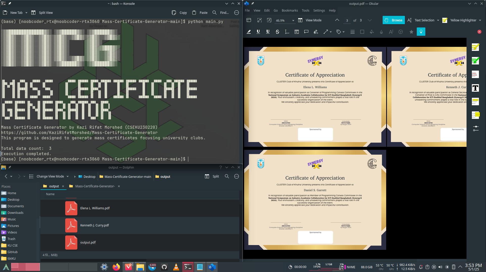
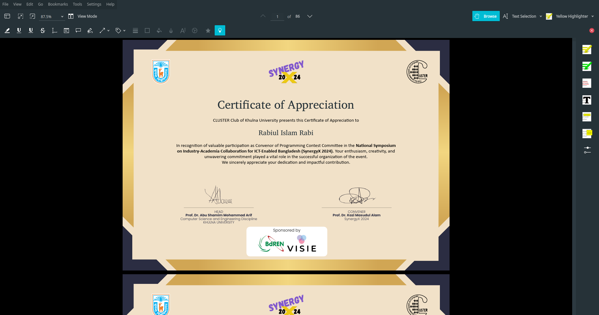

# Mass Certificate Generator

```
░▒▓██████████████▓▒░ ░▒▓██████▓▒░ ░▒▓██████▓▒░
░▒▓█▓▒░░▒▓█▓▒░░▒▓█▓▒░▒▓█▓▒░░▒▓█▓▒░▒▓█▓▒░░▒▓█▓▒░
░▒▓█▓▒░░▒▓█▓▒░░▒▓█▓▒░▒▓█▓▒░      ░▒▓█▓▒░
░▒▓█▓▒░░▒▓█▓▒░░▒▓█▓▒░▒▓█▓▒░      ░▒▓█▓▒▒▓███▓▒░
░▒▓█▓▒░░▒▓█▓▒░░▒▓█▓▒░▒▓█▓▒░      ░▒▓█▓▒░░▒▓█▓▒░
░▒▓█▓▒░░▒▓█▓▒░░▒▓█▓▒░▒▓█▓▒░░▒▓█▓▒░▒▓█▓▒░░▒▓█▓▒░
░▒▓█▓▒░░▒▓█▓▒░░▒▓█▓▒░░▒▓██████▓▒░ ░▒▓██████▓▒░
```


# Description

Mass Certificate Generator is a program to generate PDF certificates from a CSV file containing participant data, useful for university clubs and programs to create certificates within no time!

Source Code Link : [https://gitlab.com/KaziRifatMorshed/mass-certificate-generator](https://gitlab.com/KaziRifatMorshed/mass-certificate-generator)

[//]: # (# Badges)

# Visuals





# How does it work?

1. The program reads the configuration file `config.json` to get the required parameters for certificate generation.
2. It reads the data from the CSV file specified in the configuration file.
3. It uses the PDF template specified in the configuration file to generate the certificates.
4. It generates the certificates in the specified format (PDF or PNG) and saves them in the specified output directory.
5. It can generate either a single file with all certificates or individual files for each certificate, depending on the configuration.
6. It can generate certificates in either horizontal or vertical orientation, depending on the configuration.
7. It can generate certificates with a header, pre-body, body, and post-body text, depending on the configuration.

# Installation

# Usage

# Documentation

You need to have knowledge of Python and [Path](https://www.redhat.com/en/blog/linux-path-absolute-relative) to run this
program.
The program will automatically check and install the required libraries.

## Prerequisites

You need to have Python 3.6 or higher installed on your system.
You also need to have **pip** (Python package installer) installed. It usually comes with Python installations.

### Design Input

You have to design a template in PDF format for the certificate.
This is your input file. You have to name it `input_template.pdf` which will be inside the `input` folder.

### Data Input

You have to create a CSV file with the `data` folder (which is inside `input` folder) for the certificate. The CSV file
should have the following columns:

```csv
Name,Role
"ABC","Convenor of Programming Contest Committee"
"XYZ","General Secretary of Programming Contest Committee, Convenor of Prize & Gifts Committee"
```

If you want modifications in the CSV file, you can do that. You can add or remove columns as per your requirement. But
You have to edit the CSV and Python code according to your requirements.

## Configuration

### Configuration File

The configuration file is a JSON file that contains the following structure:

```json
{
  "MCG_config": [
    {
      "configId": 1,
      "debugMode": "on",
      "dataPath": "./input/data/data.csv",
      "templatePath": "./input/input_template.pdf",
      "outputPath": "./output/",
      "outputFileName": "output",
      "outputFormat": "pdf",
      "outputType": "individualFile",
      "pageOrientation": "vertical",
      "certificateHeader": "Certificate of Appreciation",
      "certificatePreBody": "CLUSTER Club of Khulna University presents this Certificate of Appreciation to",
      "certificateBody1": "In recognition of valuable participation as ",
      "certificateBody2": " in the ",
      "eventName": "National Symposium on Industry-Academia Collaboration for ICT-Enabled Bangladesh (SynergyX 2024).",
      "certificatePostBody": "Your enthusiasm, creativity, and unwavering commitment played a vital role in the successful organization of the event. <br>We sincerely appreciate your dedication and impactful contribution."
    }
  ]
}
```

### `config.json` explanation

- `debugMode`: Set to `"on"` for debugging mode, which will draw the blue colour box for the user (who is generating the certificate) to check whether the box and the inner text fit the design or not. Set to `"off"` for
  normal operation, which will not print the blue colour box.
- `dataPath`: Path to the CSV file containing the data for certificate generation. It is `"./input/data/data.csv"` by de
  default.
- `templatePath`: Path to the PDF template file for the certificate. It is `"./input/input_template.pdf"` by default.
- `outputPath`: Path to the directory where the generated certificates will be saved. It is `"./output/"` by default.
- `outputFileName`: Base name for the generated certificate files.
- `outputFormat`: Format of the generated certificates. Options are "pdf" or "png".
- `outputType`: Type of output. Options are "singleFile" (all certificates in one file) or "individualFile" (each
  certificate in a separate file).
- `pageOrientation`: Orientation of the certificate. Options are "horizontal" or "vertical".
- `certificateHeader`: Header text for the certificate.
- `certificatePreBody`: Pre-body text for the certificate.
- `certificateBody1`: Body text for the certificate.
- `certificateBody2`: Additional body text for the certificate.
- `eventName`: Name of the event for which the certificate is being issued.
- `certificatePostBody`: Post-body text for the certificate.

**NOTE: Do not remove `MCG_config` word from the JSON file. It is used to read the configuration file, which is
hardcoded in Python script.**

## Support

Tell people where they can go for help. It can be any combination of an issue tracker, a chat room, an email address, etc.

## Roadmap

- [x] Change Debug Mode
- [x] Single File Output
- [x] Individual File Output
- [ ] Change Paper Size
- [ ] Change Paper Orientation
- [ ] Change Output Format
- [ ] Change Output Type
- [ ] Change Output File Name
- [ ] Change Output Path
- [ ] Change Template Path
- [ ] Change Data Path
- [ ] Change Header Text
- [ ] Change Pre Body Text
- [ ] Change Body Text 1
- [ ] Change Body Text 2
- [ ] Change Event Name
- [ ] Change Post Body Text
- [ ] Change Font Size
- [ ] Change Font Style
- [ ] Change Text Colour
- [ ] Change Text Alignment
- [ ] Change Text Position
- [ ] GUI Implementation

## Contributing

## Authors and acknowledgement

### Author

- **Name**: Kazi Rifat Morshed
- **Affiliation**: Computer Science and Engineering Discipline
- **Alma Mater**: [Khulna University](https://www.ku.ac.bd)
- **Email**: 230220@ku.ac.bd
- **Website**: [https://kazirifatmorshed.github.io](https://kazirifatmorshed.github.io)

### Acknowledgment

- [pymupdf](https://pymupdf.readthedocs.io/en/latest/)

## License

You can edit the code to make a modified version to suit your requirements. But you have to acknowledge this repo.

## Project status

First release: 1 May 2025
Current Status: Ready to use and planned features under development
