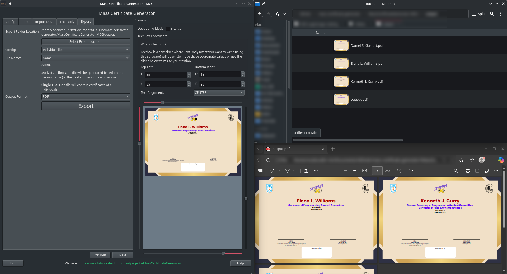

# Mass Certificate Generator

```
░▒▓██████████████▓▒░ ░▒▓██████▓▒░ ░▒▓██████▓▒░
░▒▓█▓▒░░▒▓█▓▒░░▒▓█▓▒░▒▓█▓▒░░▒▓█▓▒░▒▓█▓▒░░▒▓█▓▒░
░▒▓█▓▒░░▒▓█▓▒░░▒▓█▓▒░▒▓█▓▒░      ░▒▓█▓▒░
░▒▓█▓▒░░▒▓█▓▒░░▒▓█▓▒░▒▓█▓▒░      ░▒▓█▓▒▒▓███▓▒░
░▒▓█▓▒░░▒▓█▓▒░░▒▓█▓▒░▒▓█▓▒░      ░▒▓█▓▒░░▒▓█▓▒░
░▒▓█▓▒░░▒▓█▓▒░░▒▓█▓▒░▒▓█▓▒░░▒▓█▓▒░▒▓█▓▒░░▒▓█▓▒░
░▒▓█▓▒░░▒▓█▓▒░░▒▓█▓▒░░▒▓██████▓▒░ ░▒▓██████▓▒░
```

Mass Certificate Generator is a program to generate PDF certificates from a CSV file containing participant data, useful for university clubs and programs to create certificates within no time!

**Project Page:** [https://kazirifatmorshed.github.io/projects/MassCertificateGenerator.html](https://kazirifatmorshed.github.io/projects/MassCertificateGenerator.html)
Source Code Link : [https://gitlab.com/KaziRifatMorshed/mass-certificate-generator](https://gitlab.com/KaziRifatMorshed/mass-certificate-generator)

You can download the following binaries:
|Platform|Architecture|Link|
|---|---|---|
|Windows|AMD64|[Download](https://github.com/KaziRifatMorshed/Mass-Certificate-Generator-MCG-gh-Public/releases/download/v1.0/MassCertificateGenerator-v1.0-windows.exe)|
|Linux (executable)|AMD64|[Download](https://github.com/KaziRifatMorshed/Mass-Certificate-Generator-MCG-gh-Public/releases/download/v1.0/MassCertificateGenerator-v1.0-linux)|
|MacOS (Apple Silicon)|ARM|Upcoming|
|Android|ARM|Planned|

# Visuals



# Video Tutorial

Click the YouTube video below:  
[](https://www.youtube.com/watch?v=0W1JGwzVvLk)

# Features

  1. Tabbed Pipeline Workflow
	  MCG guides you through a logical sequence of steps using a tabbed interface:
	   * Template Selection: Select the base PDF template.
	   * Coordinate Calibration: Define text positioning, where the text will appear on the certificate.
	   * Font Management: Import and manage custom fonts (TTF, OTF, WOFF).
	   * Text Body Configuration: Define what text (constant or variable) to overlay.
	   * Data Import: Load participant data from CSV or Excel files.
	   * Export Settings: Configure output format and naming. You can save individual PDF or single file containing all certificate pages!


  2. Real-time Live Preview
	   * Dynamic Rendering & PDF Viewer: There is an integrated PDF viewer to show exactly how the final output will look, including font styles, colors, and positioning.
	   * Debug Mode: Includes a toggle to visualize the text boundary boxes, helping with precise alignment.


  3. Dynamic Font & Text Management
	   * **Custom Fonts**: Users can add multiple custom font files and assign them nicknames for easy selection.
	   * **Mixed Content**: Supports adding multiple "Text Blocks" which can be:
	       * Variable: Pulled from specific columns in your imported data (e.g., "Full Name").
	       * Constant: Static text that appears on every certificate.
	   * **Styling Options**: Each text block supports individual settings for font, size, color, and formatting (Bold, Italic, Underline).
	   * Reordering: A simple up/down movement system to change the stacking order of text blocks.
	

  4. Data Integration & Bulk Export
	   * File Support: Import data from CSV or Excel (.xlsx, .xls).
	   * **Flexible Output**:
	       * Single File: Generate one large PDF containing all certificates.
	       * Individual Files: Generate a separate PDF for each row of data.
	   * Smart Naming: Choose a column from the data (like "Name" or "ID") to automatically name the individual exported PDF files.


  5. Session Persistence
	   * **Auto-Save/Load**: The application remembers your entire configuration—including file paths, font selections, text blocks, and coordinates—across sessions. If you close MCG, it will restore your exact
	     progress when reopened.

# Documentation


## Run/compile from the source code

You need to have Python 3.8 or higher installed on your system.
You also need to have **pip** (Python package installer) installed. It usually comes with Python installations.

It is suggested to create a virtual environment for this purpose (using MCG in your machine).

# Roadmap

- [x] Change Debug Mode
- [x] Single File Output
- [x] Individual Files Output
- [x] Change Paper Size
- [x] Change Paper Orientation
- [x] Change Output Format
- [x] Change Output File Name (based on variables)
- [x] Change Output Path
- [x] Change Template Path
- [x] Change Data Path
- [ ] Android Support
- [ ] MacOS Support

## Contribution

If you want to contribute, Fork it, Work on your own repo and Push it!

# Authors and acknowledgement

## Author

- **Name**: Kazi Rifat Morshed
- **Affiliation**: Computer Science and Engineering Discipline
- **Alma Mater**: [Khulna University](https://www.ku.ac.bd)
- **Email**: rifat230220@cseku.ac.bd
- **Website**: [https://kazirifatmorshed.github.io](https://kazirifatmorshed.github.io)

## Acknowledgment

- [pymupdf](https://pymupdf.readthedocs.io/en/latest/)
- [qt](https://qt.io/)
- [Github Copilot](), [Gemini]()

# License

The Apache License 2.0 is a permissive open-source license that allows users to use, modify, and distribute software with minimal restrictions. It requires that any distributed modifications include a notice of changes and maintain the original copyright and license notices.

# Project status

First release: 1 May 2025  
Current Status: GUI implementation during Ramadan 2026.
