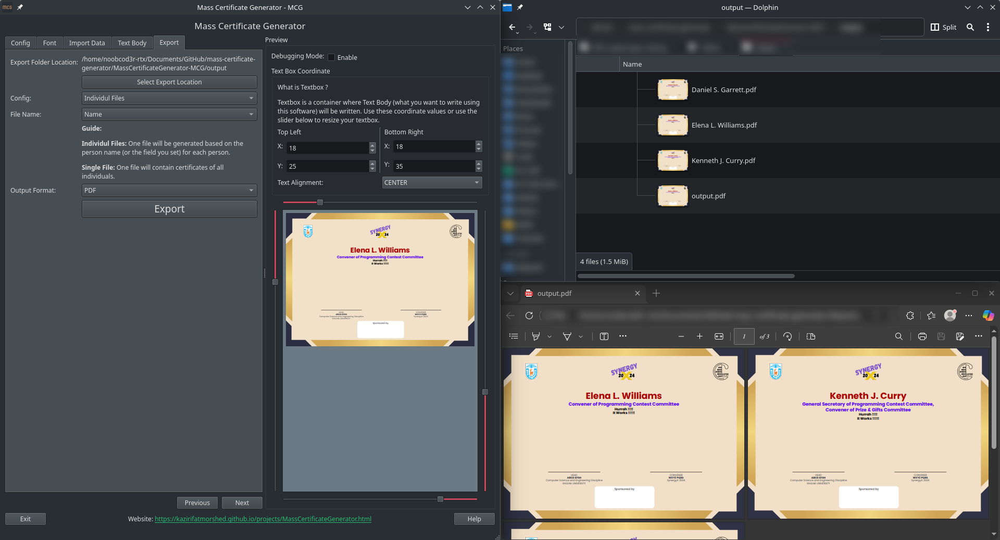

# Mass Certificate Generator

```
░▒▓██████████████▓▒░ ░▒▓██████▓▒░ ░▒▓██████▓▒░
░▒▓█▓▒░░▒▓█▓▒░░▒▓█▓▒░▒▓█▓▒░░▒▓█▓▒░▒▓█▓▒░░▒▓█▓▒░
░▒▓█▓▒░░▒▓█▓▒░░▒▓█▓▒░▒▓█▓▒░      ░▒▓█▓▒░
░▒▓█▓▒░░▒▓█▓▒░░▒▓█▓▒░▒▓█▓▒░      ░▒▓█▓▒▒▓███▓▒░
░▒▓█▓▒░░▒▓█▓▒░░▒▓█▓▒░▒▓█▓▒░      ░▒▓█▓▒░░▒▓█▓▒░
░▒▓█▓▒░░▒▓█▓▒░░▒▓█▓▒░▒▓█▓▒░░▒▓█▓▒░▒▓█▓▒░░▒▓█▓▒░
░▒▓█▓▒░░▒▓█▓▒░░▒▓█▓▒░░▒▓██████▓▒░ ░▒▓██████▓▒░
```

# Description

**Mass Certificate Generator (MCG)** is a modern, high-performance desktop application to generate bulk PDF and image certificates dynamically from CSV or Excel data. Designed for university clubs, conferences, workshops, and educational programs to produce hundreds of customized certificates in seconds!

- **Project Page:** [https://kazirifatmorshed.github.io/projects/MassCertificateGenerator.html](https://kazirifatmorshed.github.io/projects/MassCertificateGenerator.html)
- **Repository (GitHub):** [https://github.com/KaziRifatMorshed/Mass-Certificate-Generator-MCG-gh-Public](https://github.com/KaziRifatMorshed/Mass-Certificate-Generator-MCG-gh-Public)
- **Repository (GitLab):** [https://gitlab.com/KaziRifatMorshed/mass-certificate-generator](https://gitlab.com/KaziRifatMorshed/mass-certificate-generator)

<!-- # Visuals -->



# Installation & Downloads

Pre-built releases for **v1.1.0** are available across platforms:

| Platform | Format / Architecture | Source / Command |
|---|---|---|
| **Windows** | Windows Installer Setup (`.exe`) | [Download](https://github.com/KaziRifatMorshed/Mass-Certificate-Generator-MCG-gh-Public/releases/download/v1.1.0/MassCertificateGenerator-v1.1.0-Setup.exe) |
| **Windows** | Standalone Executable (`.exe`) | [Download](https://github.com/KaziRifatMorshed/Mass-Certificate-Generator-MCG-gh-Public/releases/download/v1.1.0/MassCertificateGenerator-v1.1.0-windows.exe) |
| **Arch Linux / Manjaro** | Arch User Repository (AUR) | `yay -S mass-certificate-generator` |
| **Linux (Universal)** | Standalone Binary (`.tar.gz`) | [Download](https://github.com/KaziRifatMorshed/Mass-Certificate-Generator-MCG-gh-Public/releases/download/v1.1.0/MassCertificateGenerator-v1.1.0-linux-x86_64.tar.gz) |
| **macOS (Apple Silicon)** | DMG / App Bundle | Upcoming |
| **Android** | APK | Planned |

### Arch Linux / Manjaro (AUR)

MCG is packaged for Arch Linux users via the AUR:

```bash
# Native package (recommended, lightweight)
yay -S mass-certificate-generator

# Or using paru
paru -S mass-certificate-generator
```

# Video Tutorial

Click below to watch the video demonstration and tutorial:  
[](https://www.youtube.com/playlist?list=PLTkxHCc7JjF0QC4yZf5OXDyFlfzSJvK1v)

# Key Features

### 1. Tabbed Pipeline Workflow
MCG guides you sequentially through an intuitive setup process:
* **Template Selection:** Load any custom PDF certificate template (supports any dimensions and orientations).
* **Coordinate Calibration:** Interactively define text boundaries and target positioning on the template using percentage-based bounding coordinates.
* **Font Management:** Add and manage custom TrueType (`.ttf`), OpenType (`.otf`), and Collection (`.ttc`) fonts with real-time embedding support.
* **Text Body Configuration:** Combine dynamic data layers (mapped to CSV/Excel columns) and static text with individualized fonts, sizes, formatting (Bold, Italic, Underline), and colors.
* **Data Import:** Read participant data effortlessly from `.csv` or `.xlsx` files with column auto-detection.
* **Export Settings:** Choose individual files named by recipient column or a single aggregated multi-page document, with PDF, PNG, and JPEG export formats.

### 2. Fully Event-Driven & Real-Time Sync
* **Zero Manual "Save" Hassles:** Font additions, font renaming, text changes, size tweaks, and style changes update dynamically in real time.
* **Instant Visual Preview:** Integrated PDF rendering updates immediately upon any change without manual refreshing.
* **Non-Destructive Font Renaming:** Renaming custom fonts updates all dependent text layers automatically without breaking configurations.

### 3. Robust Font Engine & Fault Tolerance
* **Automatic Embedding Sanitization:** Automatically detects and clears OS/2 table embedding restrictions (`fsType`) in memory/cache to prevent PDF engine substitute-font crashes.
* **TrueType Collection (.ttc) Support:** Full parsing and sanitization for multi-font collection files.
* **3-Tier Rendering Fallback:** If custom fonts fail or are missing, MCG automatically falls back to clean HTML styling, followed by standard PDF Base-14 fonts, ensuring export jobs never abort unexpectedly.

### 4. Non-Destructive Live Debug Mode
* Visual blue bounding box helps calibrate layout boundaries in the interactive preview without ever appearing in exported PDF/image files.

### 5. Multi-Platform Session State Persistence
* **Automatic State Recovery:** The entire workspace (loaded templates, coordinate boxes, custom font registries, text blocks, data sources, and export preferences) is saved to standard OS user data directories (`mcg_session_state.json`).
* **Debounced Disk I/O:** State saves are debounced to guarantee zero input lag during typing.
* **Safe Migration:** Automatically detects and migrates legacy session files.

# Running & Building from Source

### Prerequisites
- Python 3.9+ (Python 3.10 – 3.13 recommended)
- `pip` package manager

### 1. Clone the Repository
```bash
git clone https://github.com/KaziRifatMorshed/Mass-Certificate-Generator-MCG-gh-Public.git
cd Mass-Certificate-Generator-MCG-gh-Public/MassCertificateGenerator-MCG
```

### 2. Setup Virtual Environment
```bash
python3 -m venv .venv
source .venv/bin/activate       # On Linux/macOS
# .venv\Scripts\activate        # On Windows
```

### 3. Install Dependencies
```bash
pip install -r requirements.txt
```

### 4. Run the Application
```bash
python main.py
```

### 5. Building Standalone Binaries & Installers

MCG includes unified build scripts supporting **Nuitka** (recommended) and **PyInstaller**:

```bash
# Build standalone Linux/Windows binary with Nuitka (default)
python build_package.py

# Or build with PyInstaller
python build_package.py pyinstaller
```

On Windows, you can also run:
```bat
build_windows.bat
```
*(If Inno Setup 6 is installed, it will automatically compile the Windows Setup installer in `dist/installer/`.)*

# Roadmap

- [x] Change Debug Mode (Preview-only, non-destructive export)
- [x] Single Combined File Output
- [x] Individual File Output with dynamic file naming
- [x] Dynamic Paper Size & Orientation (any PDF dimensions)
- [x] Multi-format export (PDF, PNG, JPEG)
- [x] Fully event-driven font and text sync (no manual save buttons)
- [x] Automated font embedding restriction sanitization (.ttf, .otf, .ttc)
- [x] Cross-platform build script (Nuitka & PyInstaller) + Inno Setup installer
- [x] Arch User Repository (AUR) packaging
- [x] Self-documenting user AppData session persistence
- [ ] QR code generation and certificate verification credentials
- [ ] Auto-update notifier and updater
- [ ] macOS installer bundle (.dmg)
- [ ] Android companion app

# Authors & Acknowledgements

### Author
- **Kazi Rifat Morshed**
- Discipline: Computer Science and Engineering, [Khulna University](https://www.ku.ac.bd)
- Email: [rifat230220@cseku.ac.bd](mailto:rifat230220@cseku.ac.bd)
- Website: [https://kazirifatmorshed.github.io](https://kazirifatmorshed.github.io)

### Acknowledgements & Dependencies
- [PyMuPDF](https://pymupdf.readthedocs.io/en/latest/) – Ultra-fast PDF rendering and document manipulation
- [PySide6 / Qt](https://wiki.qt.io/Qt_for_Python) – Modern cross-platform graphical user interface
- [pandas](https://pandas.pydata.org/) & [openpyxl](https://openpyxl.readthedocs.io/) – Robust spreadsheet and CSV ingestion

# License

Distributed under the **Apache License 2.0**. See the [LICENSE](LICENSE) file for details.
